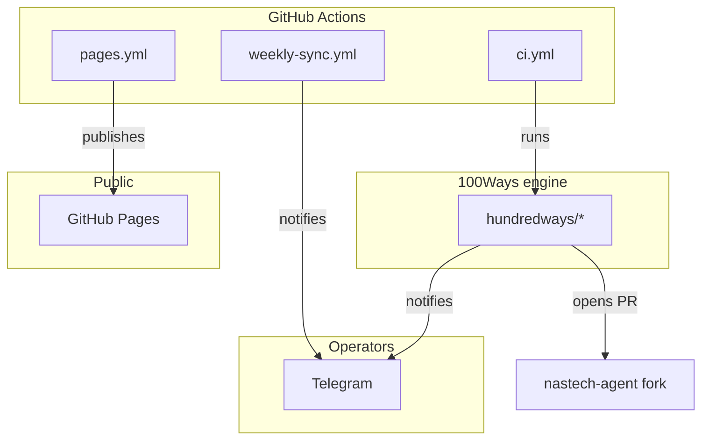
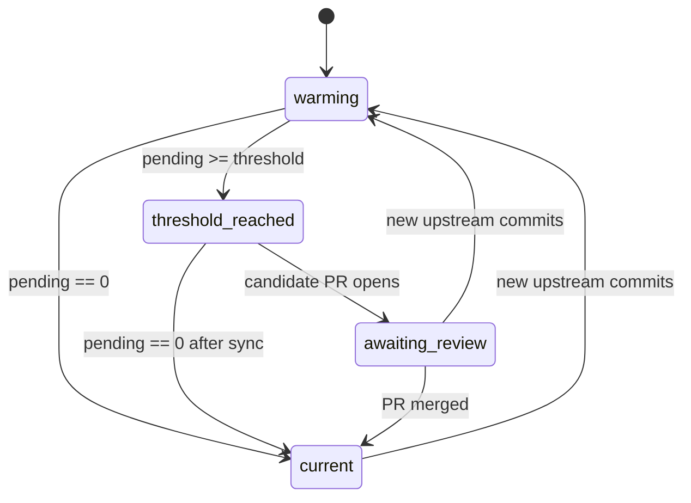

# 100Ways architecture

100Ways is a rebrand-safe fork-sync engine that ports the upstream
[`NousResearch/hermes-agent`](https://github.com/NousResearch/hermes-agent)
into the [`nastechresearch/nastech-agent`](https://github.com/nastechresearch/nastech-agent)
fork while preserving parity and brand integrity.

This document is the canonical architecture reference. Read it before
changing anything in `hundredways/`.

## Pipeline (19 stages)

| # | stage | module | purpose |
|---|---|---|---|
| 1 | `pull` | `hundredways/updates.py` | Clone the upstream Hermes tree fresh |
| 2 | `source-evidence` | `hundredways/updates.py` | Capture the direct upstream SHA as evidence |
| 3 | `census` | `hundredways/updates.py` | Walk the source tree, classify files (binary/text) |
| 4 | `plan` | `hundredways/updates.py` | Build the dependency-ordered file plan |
| 5 | `brand` | `hundredways/updates.py` + `hundredways/rules.py` | Rewrite tokens, paths, metadata to NasTech brand |
| 6 | `reconcile` | `hundredways/updates.py` | Lock nested package roots to adjacent `package.json` names |
| 7 | `preserve` | `hundredways/forkcheck.py` | Copy fork-local files (contributors, owned assets, skills) |
| 8 | `scan` | `hundredways/scanner.py` | Magic-byte + extension classifier |
| 9 | `compare` | `hundredways/forkcheck.py` | Diff against real NasTech fork |
| 10 | `verify` | `hundredways/verify.py` | Brand round-trip + forbidden token audit |
| 11 | `forkcheck` | `hundredways/forkcheck.py` | Prove unchanged files are byte-identical to the fork |
| 12 | `report` | `hundredways/report.py` + `hundredways/sync_summary.py` | Markdown + JSON |
| 13 | `package` | `hundredways/updates.py` | Zip the candidate tree |
| 14 | `manifest` | `hundredways/updates.py` | Write the per-update `manifest.json` |
| 15 | `record` | `hundredways/weekly_sync.py` | Persist upstream SHA to the ledger |
| 16 | `notify` | `hundredways/notifier.py` + `hundredways/telegram_agent.py` | Telegram alert |
| 17 | `gate` | `hundredways/weekly_sync.py` | Hardened weekly decision gate (50+ capabilities) |
| 18 | `summary` | `hundredways/sync_summary.py` | Professional update summary |
| 19 | `release` | `hundredways/release.py` + `hundredways/release_readiness.py` | Final tamper-evident receipt |

## Surfaces

- **GitHub Pages** — public, sanitized, read-only evidence surface. Schema `100ways.public-status.v1`. No tokens, chat IDs, raw logs.
- **Telegram** — operational channel. Reply keyboard (Status / Progress / Errors / Remaining / PR status / Help). Ollama Cloud advisory when `OLLAMA_API_KEY` is configured. Memory bounded to 40 events in Actions cache. Bot locked to one `TELEGRAM_CHAT_ID`.
- **NasTech fork** — receives review PRs only after every gate passes. Never auto-merged.

## Safety contract

These rules are load-bearing and must not be weakened without a code
review from a maintainer:

1. 100Ways may *only* create or update a review PR after every gate passes.
2. 100Ways never merges, tags, releases, deploys.
3. AI is advisory-only. Absent `OLLAMA_API_KEY` → fully deterministic fallback.
4. Pages payload contains no tokens, chat IDs, raw logs, private artifacts, or credentials.
5. The analyzer redacts every credential-shaped substring (`ghp_`, `github_pat_`, `gho_`, `ghs_`, `ghr_`, `glpat-`, basic-auth-in-URL, env-style secret keys) before any output reaches Pages or Telegram.

## State machine

## Bootstrap mode

The hardened gate requires the snapshot's recorded `upstream_sha` to
match the live upstream HEAD. On a fresh project the ledger is empty
AND the snapshot manifest holds a stale SHA, so the gate fails with
`source-sha-mismatch` before any sync can publish.

`bootstrap=True` (workflow_dispatch input on `ci.yml`) accepts one
one-shot reset: the gate still emits `PASS`, but `review_required=True`
forces human acknowledgement of the resulting PR. After the bootstrap
is merged, the ledger is initialized and strict mode resumes
automatically.

Bootstrap is opt-in only. The schedule path stays at threshold=50 and
will never auto-bootstrap.

## Where the code lives

| Path | Purpose |
|---|---|
| `hundredways/` | The Python engine (40 modules, ~10k LOC) |
| `scripts/` | Shell + Python entry points used by workflows |
| `tests/` | pytest suite (287 tests, 73% coverage on `hundredways/`) |
| `config/owned-assets/` | The NasTech-owned binary registry (50 assets) |
| `.github/workflows/` | The CI pipeline (`ci.yml`, `pages.yml`, `weekly-sync.yml`, stage-*.yml) |
| `site/` | Source for the GitHub Pages site |
| `docs/` | Architecture, operations, security model |
